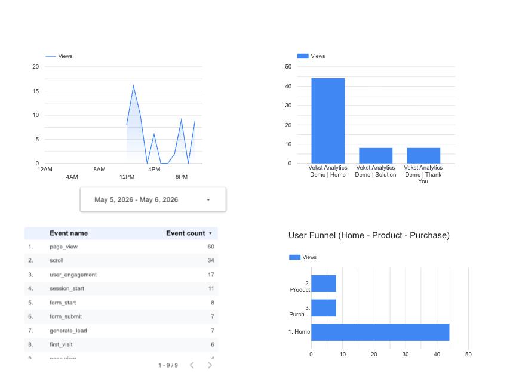

# Digital Analytics Demo Site
**A full measurement system built to simulate a real B2B analytics setup — from tracking strategy to Looker Studio reporting.**

🌐 **[View Live Demo](https://tran23qi.github.io/digital-analytics-demo-site/)**

---

## What This Is

Most analytics projects stop at dashboards.

This one starts before that — with a measurement strategy, a real tracking implementation, and a reporting layer that turns raw events into decisions.

Built as a case study to demonstrate end-to-end digital analytics work: defining KPIs, implementing GTM + GA4, setting up server-side tracking, and visualizing funnel performance in Looker Studio.

---

## The Stack

| Layer | Tool |
|---|---|
| Demo website | HTML / CSS (GitHub Pages) |
| Tag management | Google Tag Manager (`GTM-TQ9VWLLV`) |
| Analytics | Google Analytics 4 (`G-1J372B3CS8`) |
| Server-side tracking | Server-side GTM container |
| Reporting | Looker Studio |

---

## User Journey Tracked

The demo site simulates a simple B2B funnel:

```
Home → Solution (Product) → Thank You (Conversion)
```

Each step fires specific events in GA4, allowing funnel analysis and drop-off identification.

---

## Implementation

### 1. Measurement Strategy

Before writing a single line of code, I defined:

- **KPIs:** Sessions, engaged sessions, form starts, form submits, lead conversions
- **User journey:** 3-page funnel (Home → Product → Purchase)
- **Conversion logic:** `generate_lead` event on Thank You page = 1 conversion

### 2. GTM Tracking

Implemented via Google Tag Manager with the following tags:

| Tag | Type | Trigger |
|---|---|---|
| GA4 - Base | Google Tag | All pages |
| GA4 Event - test | GA4 Event | Page view |
| GA4 Event - Generate Lead | GA4 Event | Thank You page |

**GTM Tag Assistant — tags firing on live site:**


### 3. GA4 DebugView

All events verified in real time using GA4 DebugView. Key events confirmed: `page_view`, `scroll`, `session_start`, `user_engagement`.


### 4. Looker Studio Dashboard

Built a reporting dashboard to visualize:
- Session volume over time
- Page views by page (funnel drop-off visible)
- Full event breakdown
- User funnel: Home → Product → Purchase



---

## Key Insight from the Data

> Users drop significantly between **Home (44 views)** and **Product (9 views)** — a ~80% drop-off before even reaching the conversion page.

**What this signals:** The homepage is not effectively communicating value or creating urgency to explore the solution. Next step would be to investigate CTA copy, page layout, and traffic source quality.

This is the difference between *reporting* and *guiding a decision*.

---

## What This Demonstrates

- ✅ Define and implement a measurement strategy from scratch
- ✅ Work with GTM for tag and trigger management
- ✅ Validate tracking with GA4 DebugView
- ✅ Set up server-side GTM for first-party data collection
- ✅ Build a Looker Studio dashboard from GA4 data
- ✅ Turn funnel data into a concrete, actionable insight

---

## About

Built by **Anh Thy Tran** as part of a digital analytics portfolio.  
Final-year International Economics student with experience in digital marketing (Organon) and data-driven project management.

[LinkedIn](https://www.linkedin.com/in/annaa-tran/) · [Email](mailto:trananhthy1106@gmail.com)
